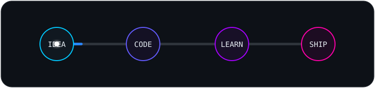

<div align="center">




<p>
  <a href="https://github.com/mustfaaaa?tab=followers"></a>
  <a href="https://github.com/mustfaaaa?tab=repositories"></a>
</p>

</div>

## 👨‍💻 About Me

```javascript
const mustafa = {
  focus: ["Artificial Intelligence", "Mobile Apps", "Full-Stack Development"],
  languages: ["Python", "Dart", "TypeScript", "Java", "JavaScript"],
  currentlyBuilding: "AI-powered products with meaningful real-world impact",
  learning: ["Machine Learning", "Flutter", "Scalable System Design"],
  openTo: ["Collaborations", "Open Source", "Interesting Ideas"],
  philosophy: "Learn. Build. Improve. Repeat."
};
```

- 🤖 I enjoy transforming AI ideas into practical applications.
- 📱 I build cross-platform experiences with Flutter and Dart.
- 🧠 My projects explore machine learning, speech, health, and intelligent automation.
- ☕ I also enjoy clean Java architecture and software design patterns.

## 🛠️ Tech Universe

<div align="center">


</div>

## 🚀 Featured Projects

<table>
  <tr>
    <td width="50%" valign="top">
      <h3 align="center">🕌 MakharijPro AI</h3>
      <p>An AI-powered Android application that detects Tajweed errors in Quran recitation in real time.</p>
      <p><b>Tech:</b> Flutter · Dart · AI</p>
      <p align="center"><a href="https://github.com/mustfaaaa/makharij-pro"><b>Explore Project →</b></a></p>
    </td>
    <td width="50%" valign="top">
      <h3 align="center">🧮 CalculusSolver</h3>
      <p>An ML-powered calculus solver that understands slang-form equations and returns precise, structured solutions.</p>
      <p><b>Tech:</b> Python · Machine Learning</p>
      <p align="center"><a href="https://github.com/mustfaaaa/CalculusSolver"><b>Explore Project →</b></a></p>
    </td>
  </tr>
  <tr>
    <td width="50%" valign="top">
      <h3 align="center">🩺 Disease Prediction</h3>
      <p>A machine-learning project focused on intelligent disease prediction from health-related data.</p>
      <p><b>Tech:</b> Python · Data Science · ML</p>
      <p align="center"><a href="https://github.com/mustfaaaa/Disease-Prediction"><b>Explore Project →</b></a></p>
    </td>
    <td width="50%" valign="top">
      <h3 align="center">🔐 Encrypted P2P System</h3>
      <p>A peer-to-peer communication system exploring secure networking and encrypted messaging.</p>
      <p><b>Tech:</b> Java · Networking · Cryptography</p>
      <p align="center"><a href="https://github.com/mustfaaaa/Peer-to-Peer-Encrypted-Communication-System"><b>Explore Project →</b></a></p>
    </td>
  </tr>
</table>

## 📊 GitHub Analytics

<div align="center">


</div>

## ⚡ Building in Public

<div align="center">



<picture>
  <source media="(prefers-color-scheme: dark)" srcset="https://raw.githubusercontent.com/mustfaaaa/mustfaaaa/output/github-contribution-grid-snake-dark.svg" />
  <source media="(prefers-color-scheme: light)" srcset="https://raw.githubusercontent.com/mustfaaaa/mustfaaaa/output/github-contribution-grid-snake.svg" />
  
</picture>

</div>

## 🎯 Current Mission

```text
Build useful AI products  ███████████████░░░░░  75%
Master Flutter            █████████████░░░░░░░  65%
Contribute to open source ████████░░░░░░░░░░░░  40%
Never stop learning       ████████████████████ 100%
```

## 🤝 Let's Build Something Great

<div align="center">

I am always interested in meaningful collaborations, open-source projects, and creative tech ideas.

<a href="https://github.com/mustfaaaa">
  
</a>

### 💭 “Code is where imagination becomes useful.”


</div>
